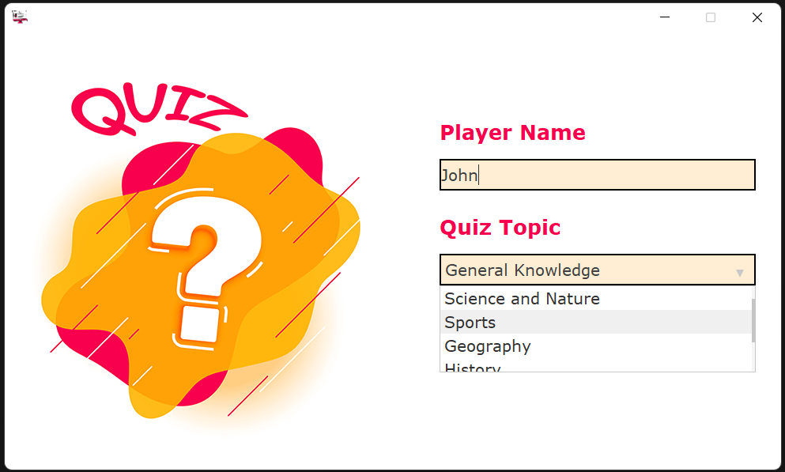
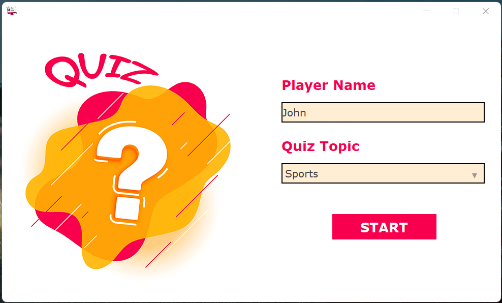
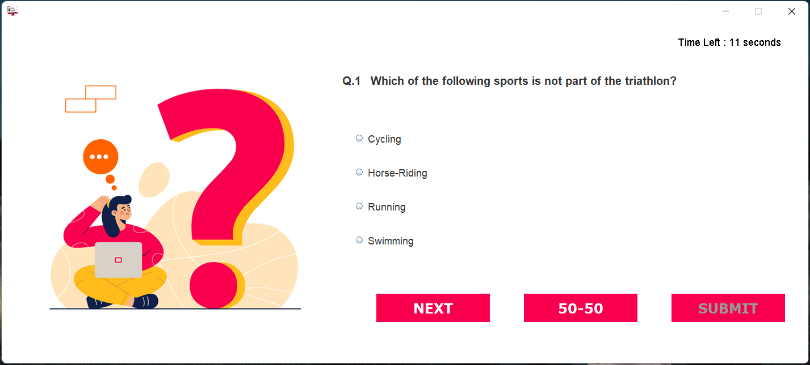

# Quiz Application

This Quiz application lets you test your knowledge on a variety of topics, including General Knowledge, Science and Nature, Sports, Geography, History, Politics, and Vehicles. Each topic contains a pool of questions with varying difficulty levels, from easy, medium, to hard.

When you start the quiz, you can choose a topic you want to test yourself on, and the application will randomly select 10 questions from that topic for you to answer. You will have 20 seconds to answer each question by choosing the correct option from the given choices.

Notable features of this application include:

* Multiple topics to choose from
* Questions of varying difficulty levels
* **50:50 feature** to eliminate two incorrect options
* Timer feature to limit the time for answering each question

Whether you're brushing up on your knowledge, or just looking to have some fun, this quiz application is the perfect way to challenge yourself and learn something new.

# How to use the application
To install and run the Quiz Application, follow these steps:

* Download the **Quiz-app.jar** file from the project's GitHub repository.
* Install the latest version of Java on your computer.
* Open the command prompt or terminal and navigate to the directory where the Quiz-app.jar file is located.
* Run the command **java -jar Quiz-app.jar** to launch the application.

# Application Preview

# Contributing
If you want to contribute to the Quiz Application, follow these steps:

1. Fork the project's GitHub repository.
2. Make the necessary changes to the code or documentation.
3. Test your changes thoroughly.
4. Submit a pull request to the project's GitHub repository.

# License

The Quiz Application is released under the MIT License. See the LICENSE file for more information.

# Contact

If you have any questions or feedback about the Quiz Application, you can contact the project's maintainer at 2001shashwat.rdr@gmail.com

